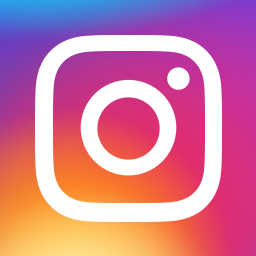

# All About Me

This is my final project for AP Computer Science Principles. In this project, I am required to show my name, a picture of myself, my social media, and my brag sheet. Here is the aforementioned information:

---

## Name

My name is Edison Wang.

## Picture

Here is a picture of me:

## Social Media

Some social media I use include Instagram, Discord, and Snapchat. Click on each of the social media app icons to see my social media information.

  

## Brag Sheet

- **Academics**
  - Has participated in 7 total AP classes so far and is currently taking 5 in junior year
  - Straight A's across all subjects
  - Hobby in computer science
  - Won a regional competition in Green Generation for Science Olympiad and placed high in other competitions
  - Participated in the Chemistry Science Team
  - Participated in the Math Club
  - SET member of the John Hopkins Grand Ceremony
- **Athletics**
  - Participated in multiple competitions, including JOs and Sectionals
  - Best cut is currently a FUTR cut in the 200 back LC
- **Work Experience**
  - Volunteering with audio at the local Chinese school
  - Volunteering with Scarlet Aquatics Club for coaching/training
  
---
